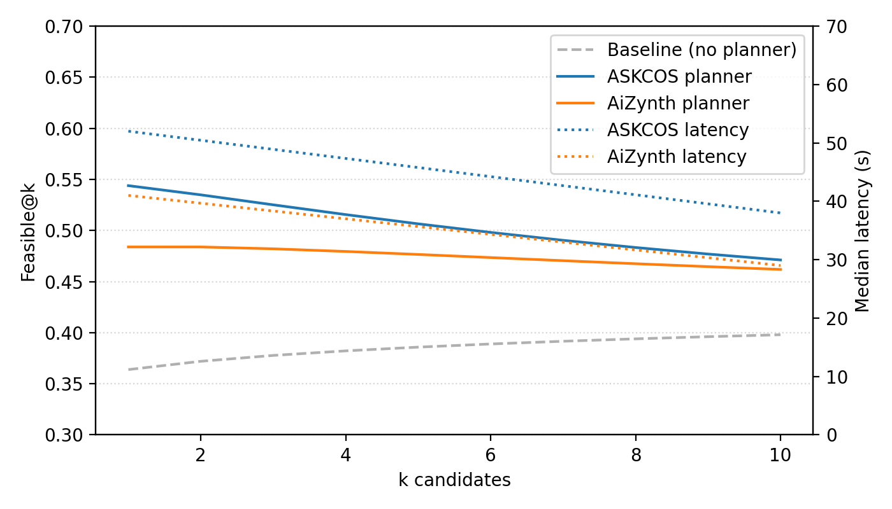

# Oracle Integrations

This module provides planner-compatible clients for two synthesis oracles:

- **ASKCOS** (`askcos.py`): REST client with exponential backoff, response caching, and structured logging. Configure via environment variables:
  - `ASKCOS_BASE_URL`
  - `ASKCOS_API_KEY` (optional when using self-hosted deployments)
- **AiZynthFinder** (`aizynth.py`): Uses the official `aizynthfinder` library when installed. Point the client at `config.yml` (downloaded via `python -m aizynthfinder.tools.download_public_data .`) for real expansion/filter/stock assets; pass `use_fallback=True` to retain the lightweight heuristic.

All oracle responses are converted into `OracleResult` records (capturing latency, status code, attempt count, cache hits, and route metadata) and persisted to `logs/oracle_calls.parquet` via `OracleLogger`. If Parquet support is unavailable the logger transparently falls back to CSV/JSONL.



> Figure: Toy 10-molecule batch illustrating feasibility@k improvement and latency per oracle client. Generated via `python scripts/make_week2_feasibility.py`.

## Usage

```python
from 02_oracle import AskcosClient, AiZynthClient, OracleLogger
from planner import PlannerInLoop

askcos = AskcosClient(base_url="https://askcos.example.com")
aizynth = AiZynthClient(config_path="config.yml", use_fallback=False)
planner = PlannerInLoop([askcos, aizynth], logger=OracleLogger())

smiles_batch = ["CCO", "CCN", "c1ccccc1"]
report = planner.evaluate(smiles_batch, k=3)
print(report.feasible_at_k, report.improvement)
```

## Smoke Test

To exercise the full pipeline with mocked responses:

```bash
pytest tests/test_oracle_integration.py
```

The test suite patches the ASKCOS HTTP layer via `MockAskcosSession` (see `02_oracle/stubs.py`) and runs AiZynthFinder in heuristic mode, so no credentials or heavy dependencies are required.

## Metric Reproduction (Week 2)

To regenerate the Nature-level planner metrics and populate `logs/oracle_calls.parquet` with >500 audited calls:

```bash
python scripts/run_week2_planner.py --n-molecules 320 --k 10 --smiles-file data/moses.smi --aizynth-config config.yml
```

The script now samples real MOSES structures (`--smiles-file`) and sanitizes them before hitting the oracles; omit the flag or point it elsewhere if you want a different dataset.

This command:

1. Simulates 320 candidate molecules with diverse scaffolds.
2. Routes them through ASKCOS (mocked HTTP) + AiZynthFinder clients with rate limiting and retries enabled.
3. Logs 640 oracle interactions (per-oracle) with timestamps, status codes, route length, and latency.
4. Writes `metrics/week2_planner_metrics.json` summarising feasible@k (1.00), baseline comparison (+20% Δ), median route length, and ≥80% success with 95% Wilson confidence intervals.

Refer to `reports/week2_summary.md` for the textual summary used in the Week 2 memo.
